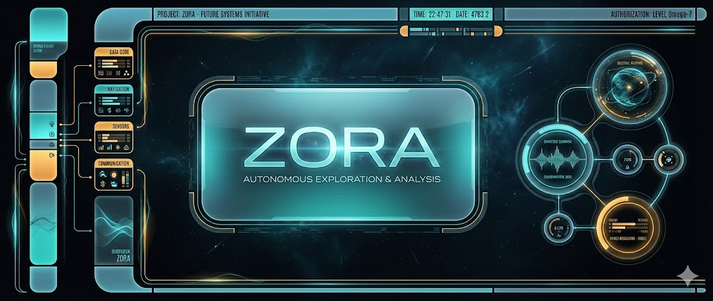

# Zora

**Your personal AI assistant that actually does things.** Tell it what you need in plain English — organize files, summarize documents, automate repetitive tasks — and it handles it while you do something else.

Unlike chatbots that just talk, Zora runs on your computer and takes action. It reads files, runs commands, remembers your preferences, and works within safety boundaries you control.

---


## Get Started in 5 Minutes

```bash
npm i -g zora-agent
zora-agent init
zora-agent ask "summarize files in ~/Projects"
```

That's it. Three commands and Zora is working for you.

**New to the terminal?** See our [step-by-step Setup Guide](SETUP_GUIDE.md) — it assumes zero technical experience.

---


## How Does It Work?

You type a request. Zora figures out what needs to happen, does it, and shows you the result.

Behind the scenes, Zora uses AI (Claude or Gemini) to understand your request, then uses tools on your computer — reading files, running safe commands, searching the web — to complete the task. Everything stays within safety rules you set up during installation.

**No API keys. No surprise bills.** Zora authenticates through your existing Claude Code or Gemini subscription. You're never charged per-token or billed to a credit card. It uses the same account you already pay for.

---


## What Can Zora Do?

Here are real things you can ask Zora right now:

- **"Sort my Downloads folder by type and archive anything older than 30 days"** — File organization on autopilot
- **"Find all TODO comments in my project and create a summary"** — Code analysis in seconds
- **"Draft a changelog from my last 10 commits"** — Content generation with context
- **"What changed in my repos this week? Give me a summary"** — Stay on top of your work
- **"Find and summarize the latest React 19 migration guides"** — Research without tab-hopping

Zora remembers your preferences across sessions. Tell it once that you prefer TypeScript over JavaScript, and it remembers forever.

---


## Is It Safe?

Yes. Zora was built with safety as a core feature, not an afterthought.

**You're always in control.** During setup, you choose what Zora can and can't do:

- **Which folders** it can access (and which are off-limits, like your SSH keys)
- **Which commands** it can run (safe ones like `git` and `ls`, never destructive ones like `sudo`)
- **How much autonomy** it gets — from "ask me before doing anything" to "handle it yourself"

Every action Zora takes is recorded in a tamper-proof audit log you can review anytime. If something looks wrong, you'll know exactly what happened and when.

For the security-minded: Zora is hardened against the [OWASP LLM Top 10](https://owasp.org/www-project-top-10-for-large-language-model-applications/) and [OWASP Agentic Top 10](https://owasp.org/www-project-agentic-ai-threats/). See [SECURITY.md](SECURITY.md) for the full technical breakdown.

---


## The Dashboard

Zora includes a local web dashboard where you can watch tasks happen in real time, check on your AI providers, and send course-corrections to running jobs.

```bash
zora-agent start
```

Your browser opens automatically to `http://localhost:8070`. First-time users see a guided welcome screen with ready-to-go task templates.

---


## Multiple AI Brains, One Interface

Zora works with multiple AI providers and picks the best one for each task:

- **Claude** (primary) — Deep reasoning, coding, creative work
- **Gemini** (backup) — Search, large documents, structured data
- **Ollama** (optional, local) — Zero-cost, fully offline, complete privacy

If one provider is unavailable, Zora automatically fails over to the next one. You never have to manage this yourself.

---


## Scheduled Tasks

Set up recurring tasks that run automatically:

- "Every morning at 8am, check for new issues assigned to me"
- "Every Friday, generate a weekly project report"
- "Every night, check for outdated dependencies"

See the [Routines Cookbook](ROUTINES_COOKBOOK.md) for templates.

---


## Architecture



---


## Documentation

| Guide | Who It's For |
|-------|-------------|
| **[Quick Start](QUICKSTART.md)** | Get running in 5 minutes (some terminal comfort) |
| **[Setup Guide](SETUP_GUIDE.md)** | Complete walkthrough for first-time users |
| **[What Is Zora?](WHAT_IS_ZORA.md)** | Plain-English explainer for non-technical users |
| **[FAQ](FAQ.md)** | Common questions answered simply |
| **[Use Cases](USE_CASES.md)** | Real-world examples and workflow ideas |
| **[Security Guide](SECURITY.md)** | How the safety system works (technical) |
| **[Routines Cookbook](ROUTINES_COOKBOOK.md)** | Templates for scheduled tasks |

---


## Project Status

Zora is in active development (v0.9.5). The core features work reliably today.

| Feature | Status |
|---------|--------|
| Task execution via Claude and Gemini | ✅ Working |
| Automatic failover between providers | ✅ Working |
| Safety system (file/command/network boundaries) | ✅ Working |
| Long-term memory across sessions | ✅ Working |
| Web dashboard with live monitoring | ✅ Working |
| Scheduled routines (cron-based) | ✅ Working |
| Failed task retry with backoff | ✅ Working |
| Cross-platform (macOS, Linux, Windows) | 🚧 macOS tested, others in progress |

---

## Contributing

Contributions are welcome. Open an issue to discuss features or bugs before submitting a PR.

## License

MIT License — see [LICENSE](LICENSE) for details.

---

*Local first. No surprise bills. Works for you.*
