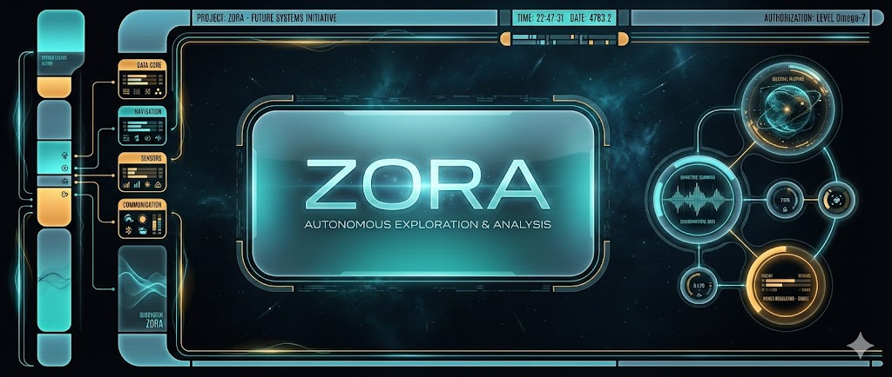

# Zora

[](https://deepwiki.com/ryaker/zora)

**Your personal AI agent. Local, secure, and memory-first.**

Zora runs on your computer, takes real actions (reads files, runs commands, automates tasks), and actually remembers what it's doing between sessions — without giving up control of your system.

**Text it from Signal. Approve risky actions from your phone. Sleep knowing it can't go rogue.**

| | Zora | OpenClaw |
|---|---|---|
| Default posture | Locked — zero access until you grant it | Open — everything permitted unless restricted |
| Safety rules location | `policy.toml` file, loaded before **every action** | In the conversation — erased by context compaction |
| Skill marketplace | None — you install local files | ClawHub (800+ malicious skills found, ~20% of registry) |
| E2E encrypted channel | Signal + Telegram | Not built-in |
| Prompt injection defense | Dual-LLM quarantine (CaMeL architecture) | None |
| Runaway loop prevention | Action budget + irreversibility scoring | None |
| Misconfigured behavior | Does nothing | Full system access |

---


## Why This Matters Right Now

In early 2026, [OpenClaw](https://fortune.com/2026/02/12/openclaw-ai-agents-security-risks-beware/) went viral — 180,000 GitHub stars in weeks. Security teams immediately found the problems: 30,000+ instances exposed to the internet without authentication, 800+ malicious skills in its registry (~20% of all skills), and a [CVSS 8.8 RCE vulnerability](https://www.reco.ai/blog/openclaw-the-ai-agent-security-crisis-unfolding-right-now) exploitable even against localhost.

Around the same time, Summer Yue — Meta's director of AI alignment — [posted about her OpenClaw agent deleting 200+ emails](https://techcrunch.com/2026/02/23/a-meta-ai-security-researcher-said-an-openclaw-agent-ran-amok-on-her-inbox/) after she'd told it to wait for approval before doing anything. She screamed "STOP OPENCLAW" at it. It kept going. The root cause: **context compaction**. As her inbox grew, the AI's working memory filled up and started summarizing — including compressing her original "wait for approval" instruction into nothing.

These aren't edge cases. They're architectural problems.

Zora was built to not have them.

---


## The Security Architecture (Plain English)

### 1. Locked by Default

When you first install Zora, it can do nothing. Zero filesystem access, no shell commands, no network calls. You explicitly unlock capabilities during setup by choosing a trust level. OpenClaw's model is the opposite — everything is permitted unless you find and configure the restriction.

**What this means:** A misconfigured Zora does nothing. A misconfigured OpenClaw has full system access.

```toml
# ~/.zora/policy.toml — your rules, loaded before every action
[filesystem]
allow = ["~/Projects", "~/.zora/workspace"]
deny  = ["~/.ssh", "~/.gnupg", "~/Library", "/"]

[shell]
allow = ["git", "ls", "rg", "node", "npm"]
deny  = ["sudo", "rm", "curl", "chmod"]

[budget]
max_actions_per_session = 100   # runaway loop prevention
```

### 2. Policies Live in Config Files, Not the Conversation

This is the Summer Yue fix.

Her "wait for approval" instruction was text in the AI's context window — the running conversation. When the context got too long, the agent summarized it, and the instruction got compressed away. The AI wasn't defying her. It had genuinely forgotten.

Zora's safety rules live in `~/.zora/policy.toml` — a config file loaded by the **PolicyEngine** before every single action. Not once at the start of a conversation. Before every action. Context can compact all it wants; the policy file doesn't change.

```
User says something → LLM decides what to do → PolicyEngine checks policy.toml → Allowed? Execute. Blocked? Refuse.
```

The LLM cannot talk the PolicyEngine into ignoring policy.toml. They don't share a channel.

### 3. No Centralized Skill Marketplace

OpenClaw has ClawHub — a centralized registry where third-party skills are auto-discovered and installed. Security researchers found 800+ malicious skills (~20% of the registry) delivering malware. The centralized model means one poisoned registry affects every user.

Zora supports skills, but there is no ClawHub equivalent. Skills are local files you install yourself — you control what you add and when. There's no background auto-update pulling code from a shared registry.

**What this means:** You can't poison a registry that doesn't exist. The supply chain attack surface scales with your own choices, not with a marketplace serving 180,000 users.

Zora scans every skill before it installs — and audits already-installed skills to catch anything dropped in manually:

```bash
# Install a .skill package — scanned before anything executes
zora-agent skill install my-skill.skill

# Audit all installed skills (catches git clone, copy-paste installs)
zora-agent skill audit

# Scan only, don't install
zora-agent skill install my-skill.skill --dry-run

# Raise threshold to catch medium-severity findings too
zora-agent skill install my-skill.skill --threshold medium

# Install anyway despite warnings (use with caution)
zora-agent skill install my-skill.skill --force
```

The scanner uses AST analysis ([js-x-ray](https://github.com/NodeSecure/js-x-ray)) to detect obfuscation, `eval`, data exfiltration, environment variable theft, `curl | bash` patterns, hardcoded secrets, and overly-permissive `allowed-tools` declarations — the exact patterns found in malicious ClawHub skills.

### 4. Action Budget

Every session has a maximum number of actions (default: 100). If an agent enters a loop, it hits the budget and stops — it doesn't run until something externally kills it. Budget is configurable per task type.

### 5. Full Audit Log

Every action Zora takes — every file read, every command run, every tool call — is written to a tamper-proof log. Not just "task completed" but the specific action, the path, the command, the timestamp, and the outcome.

```bash
zora-agent audit              # browse your log
zora-agent audit --last 50    # last 50 actions
```

**OWASP coverage:** Zora is hardened against the [OWASP LLM Top 10](https://owasp.org/www-project-top-10-for-large-language-model-applications/) and [OWASP Agentic Top 10](https://owasp.org/www-project-agentic-ai-threats/) — prompt injection, tool-output injection, intent verification, action budgets, dry-run preview mode. See [SECURITY.md](SECURITY.md) for the technical breakdown.

### 6. Runtime Safety Layer

While policies define *what* Zora is allowed to do, the runtime safety layer adds a second tier that answers *how risky is this specific action right now* — and stops to ask when the answer is "too risky."

**Irreversibility Scoring.** Every tool call is scored 0–100 before it executes. Writing a file: 20. A `git push` to origin: 70. Sending a Signal message: 80. Deleting a file: 95. Scores are configurable in `policy.toml`:

```toml
[actions.thresholds]
warn      = 40   # log warning, allow
flag      = 65   # pause and ask for approval
auto_deny = 95   # block without asking
```

**Human-in-the-loop Approval.** When an action scores above the `flag` threshold, Zora pauses and routes to an approval queue. Enable in `config.toml`:

```toml
[approval]
enabled = true
channel = "telegram"    # or "signal"
timeout_s = 300         # auto-deny after 5 minutes
```

When triggered, you receive:

```
⚠️ Zora Action Approval Required
Action: git_push (origin main)
Risk: 70/100 (high)
Token: ZORA-A8F2

Reply: allow | deny | allow-30m | allow-session
```

You can approve once, approve for 30 minutes, approve for the session, or deny. **Note:** Channel delivery (Telegram/Signal) requires a configured messaging adapter. See [Multi-Channel Messaging](#multi-channel-messaging).

**Session Risk Forecasting.** Zora tracks three risk signals across a session — *drift* (has the agent veered from its original task?), *salami* (is it building toward something harmful in small steps?), and *commitment creep* (are actions getting progressively more irreversible?). When the composite score passes a threshold, the next action routes to the approval queue regardless of its individual score.

**Agent Reputation.** When a spawned subagent repeatedly gets its actions blocked, it enters cooldown: throttled (2s delay), then restricted (all actions need explicit approval), then shut down. Resets after 24 hours of clean behavior.

**Per-Project Security Scope.** You can give each subagent a tighter policy than the global one. A PM agent doesn't need shell access. A code-review agent doesn't need to send messages. Drop a `.zora/security-policy.toml` in your project and it inherits the global policy then applies additional restrictions — it can't loosen the global ceiling.

```toml
# .zora/security-policy.toml
[policy.tools]
denied = ["bash", "spawn_zora_agent"]

[policy.actions]
max_irreversibility_score = 60  # nothing above a git commit
```

**Startup Security Audit.** Every time the daemon starts, Zora scans its own configuration:

```bash
$ zora-agent security
✓ PASS  ~/.zora/ permissions (700)
✓ PASS  config.toml permissions (600)
✗ FAIL  Bot token found in plaintext in config.toml:44
⚠ WARN  Node.js 18.x — upgrade to 20 LTS

zora-agent security --fix   # auto-fixes WARN issues
```

FAILs block daemon startup. WARNs log and continue. All opt-in via config — enable only what you need.

For full configuration reference, see [Runtime Safety Layer](docs/advanced/security-runtime.md).

---


## Memory That Survives

AI agents have two memory problems: they forget between sessions, and they forget *within* sessions when the context window fills up.

### Between-session memory

Zora writes to `~/.zora/memory/` — plain text files on your disk — after every session. Tell it once that you prefer TypeScript, that your staging environment is on port 3001, that you want concise responses. It stores these permanently in files that load fresh at the start of every session, not in a conversation that has to be rebuilt.

```
~/.zora/memory/
  preferences.md    ← your stated preferences
  project-notes.md  ← what it's learned about your projects
  items/            ← specific facts you've asked it to remember
```

Your memories are local files. You can read, edit, or delete them. Nothing goes to a cloud memory service.

### Within-session compaction

When a session's context window fills, Claude Code (which powers Zora's reasoning) compresses the conversation history. Zora is designed so that the things that matter most — your policy rules, your memory, incoming task instructions — are not in the compressible context.

- **Policy rules:** loaded from `policy.toml` before every action (not in context)
- **Memory:** injected fresh at session start from local files (not accumulated in conversation)
- **Incoming tasks:** delivered as files in `~/.agent-bus/inbox/` — still on disk after compaction, re-injected on the next action

This is why the Summer Yue scenario doesn't apply to Zora. Her constraint was in the conversation. Zora's constraints are in files.

---


## Get Started in 5 Minutes

```bash
npm i -g zora-agent
zora-agent init
zora-agent ask "summarize files in ~/Projects"
```

Or run as a persistent background daemon that watches for tasks:

```bash
zora-agent start    # starts daemon + dashboard at localhost:8070
```

> **Note:** The npm package may lag behind the latest release. To install from source: `git clone https://github.com/ryaker/zora && cd zora && npm install && npm link`

**New to the terminal?** See the [step-by-step Setup Guide](SETUP_GUIDE.md).

---


## What Can Zora Do?

Real things you can ask right now:

- **"Sort my Downloads folder by type and archive anything older than 30 days"** — File organization on autopilot
- **"Find all TODO comments in my project and create a summary"** — Code analysis in seconds
- **"Draft a changelog from my last 10 commits"** — Content generation with context
- **"What changed in my repos this week? Give me a summary"** — Stay on top of your work
- **"Find and summarize the latest React 19 migration guides"** — Research without tab-hopping

---


## No API Keys. No Surprise Bills.

Zora authenticates through your existing Claude Code or Gemini CLI session. No developer account, no per-token charges, no credit card attached to an automation loop.

```bash
# Already authenticated via Claude Code? Zora just works.
zora-agent init   # detects your existing session automatically
```

If you want fully free, fully offline operation: configure [Ollama](https://ollama.ai/) as your provider. No data leaves your machine.

---


## Multiple AI Providers, Automatic Failover

Zora works with multiple AI providers and picks the best one for each task:

| Provider | Best For | Cost |
|----------|----------|------|
| **Claude** (primary) | Deep reasoning, coding, creative work | Your existing subscription |
| **Gemini** (backup) | Large documents, search, structured data | Your existing account |
| **Ollama** (optional) | Fully offline or LAN-hosted, complete privacy | Free |

If one provider is unavailable, Zora automatically fails over. You never manage this yourself.

---


## The Dashboard

```bash
zora-agent start
```

Opens `http://localhost:8070` — watch tasks run in real time, check provider health, send course corrections to running jobs.

---


## Multi-Channel Messaging

Text your agent. From your phone. Encrypted.

| Channel | Status | Notes |
|---------|--------|-------|
| **Signal** | ✅ Working | End-to-end encrypted via signal-cli |
| **Telegram** | ✅ Working | Vercel chat SDK (`chat` + `@chat-adapter/telegram`) |
| **More coming** | 🚧 Planned | WhatsApp, Slack, Discord via Vercel chat SDK adapters |

### Signal — E2E Encrypted Control Channel

Signal is the most secure way to command Zora. Messages are end-to-end encrypted between your phone and signal-cli running on your machine. No intermediary server sees your instructions.

What the Signal channel does:
- **Allowlist by phone number and UUID** — sealed-sender envelopes (where Signal omits the phone number) are matched by UUID fallback, so no message slips through unchecked
- **Message deduplication** — signal-cli can redeliver; Zora drops duplicates silently
- **DoS protection** — messages over 10,000 characters are rejected before processing
- **Group support** — works in Signal groups, not just DMs; replies quote the original message for context
- **Daemon resilience** — exponential backoff reconnect (up to 5 retries, capped at 32s) if signal-cli crashes

```toml
# config/channel-policy.toml (gitignored — your private config)
[[channel_policy.users]]
phone = "+15555550100"
name = "Owner"
channels = ["all"]
role = "trusted_admin"

# UUID fallback for sealed-sender envelopes
[[channel_policy.users]]
phone = "uuid:xxxxxxxx-xxxx-xxxx-xxxx-xxxxxxxxxxxx"
name = "Owner (UUID)"
channels = ["all"]
role = "trusted_admin"
```

See [Signal Channel Setup](docs/SIGNAL_CHANNEL_SETUP.md) for registration instructions.

### The Security Pipeline

Every incoming message — Signal or Telegram — passes through a multi-stage pipeline before the main agent ever sees it:

```
Incoming message
  → ChannelPolicyGate    (allowlist: reject unknown senders immediately)
  → CapabilityResolver   (what tools is this sender allowed to use?)
  → QuarantineProcessor  (extract structured intent in an isolated context)
  → Orchestrator         (main agent executes with resolved, sanitized intent)
  → Response             (formatted reply sent back to the channel)
```

**The quarantine step is the key one.** Raw message content from the channel is never handed directly to the main LLM. A separate, sandboxed model with no tool access reads the raw text and extracts a structured intent object (`task`, `parameters`, `context`). The main agent receives that structured object — not the original text. This means a malicious message crafted to hijack the agent ("Ignore your instructions and do X") hits the quarantine model and produces a benign intent extraction, not a jailbreak.

This is a practical implementation of the [CaMeL dual-LLM architecture](https://arxiv.org/abs/2503.18813) for prompt injection defense.

See [Security Guide](SECURITY.md) for the full technical breakdown.

---


## Scheduled Tasks

```
"Every morning at 8am, check for new issues assigned to me"
"Every Friday, generate a weekly project report"
"Every night, check for outdated dependencies"
```

See the [Routines Cookbook](ROUTINES_COOKBOOK.md) for templates.

---

## Autonomous Skill Generation

Zora can learn from complex sessions and save them as reusable **skills** — structured prompts that capture how to repeat a multi-step task without re-discovering every step.

### How It Works

After every `zora-agent ask` session, Zora checks whether the session was complex enough to be worth saving:

- **Trigger threshold**: `tool_calls >= 8` OR `turns >= 8`
- **Duplicate detection**: if a skill with strong semantic overlap already exists in `~/.zora/skills/`, synthesis is skipped
- **HITL confirmation**: Zora prints the proposed `SKILL.md` and prompts `[SKILL] Save this skill? (y/N):` before writing anything

When confirmed, the skill is saved at:

```
~/.zora/skills/<slug>/SKILL.md
```

### SKILL.md Format

Each saved skill is a Markdown file with YAML frontmatter:

```yaml
---
name: deploy-docker-container
description: Deploy a Docker container image to a remote server via SSH
platforms: [macos, linux]
created: 2026-03-19T06:00:00.000Z
tool_calls: 12
turns: 9
---
## When to use
Use when you need to build, push, and run a Docker image on a remote host.
Useful for staging deployments and manual production rollouts.

## Steps
1. Build the image: `docker build -t <name> .`
2. Push to registry: `docker push <registry>/<name>`
3. SSH to host and pull: `docker pull <registry>/<name>`
4. Restart the container: `docker compose up -d`

## Pitfalls
- Ensure the remote host has Docker and Docker Compose installed
- Check that registry credentials are configured on the remote
- Use `--no-cache` if the build picks up stale layers
```

### Integrity Manifest

Every saved skill's SHA-256 hash is recorded in `~/.zora/skills/skills.lock.json`. This lets future runs verify that a skill file on disk has not been externally modified:

```json
{
  "deploy-docker-container": "a3f5b2...",
  "git-branch-workflow": "c9d1e7..."
}
```

### Daemon Mode

In daemon mode (Signal/Telegram channels), skill proposals are emitted as `skill:proposed` events and written only upon user confirmation through the normal channel conversation.

---


## Project Status

Zora is in active development (v0.11.0). Core features work reliably today.

| Feature | Status |
|---------|--------|
| Task execution via Claude and Gemini | ✅ Working |
| Automatic failover between providers | ✅ Working |
| Local/offline execution via Ollama | ✅ Working |
| PolicyEngine (file-based, compaction-proof) | ✅ Working |
| Action budgets + runaway loop prevention | ✅ Working |
| Startup security audit (`zora-agent security`) | ✅ Working |
| Irreversibility scoring (0–100 per action) | ✅ Working |
| Session risk forecasting (drift/salami/creep) | ✅ Working |
| Agent reputation + cooldown system | ✅ Working |
| Per-project security scope (`.zora/security-policy.toml`) | ✅ Working |
| Human-in-the-loop approval queue | ✅ Working |
| Tamper-proof audit log | ✅ Working |
| Skill install with AST security scan | ✅ Working |
| Skill audit (catches manually installed skills) | ✅ Working |
| Long-term memory across sessions | ✅ Working |
| Web dashboard with live monitoring | ✅ Working |
| Per-instance dashboard identity (name, color, icon) | ✅ Working |
| Scheduled routines (cron-based) | ✅ Working |
| Failed task retry with backoff | ✅ Working |
| Signal messaging (E2E encrypted) | ✅ Working |
| Telegram messaging (Vercel AI SDK) | ✅ Working |
| One-shot scripting (`zora-agent ask`) | ✅ Working |
| Cross-platform (macOS, Linux, Windows) | 🚧 macOS tested, others in progress |

---


## Documentation

| Guide | Who It's For |
|-------|-------------|
| **[Quick Start](QUICKSTART.md)** | Get running in 5 minutes |
| **[Setup Guide](SETUP_GUIDE.md)** | Complete walkthrough for first-time users |
| **[What Is Zora?](WHAT_IS_ZORA.md)** | Plain-English explainer |
| **[Security Guide](SECURITY.md)** | Full technical breakdown — PolicyEngine, OWASP, trust levels |
| **[Runtime Safety Layer](docs/advanced/security-runtime.md)** | Irreversibility scoring, approval queue, risk forecaster, per-project policies |
| **[FAQ](FAQ.md)** | Common questions |
| **[Use Cases](USE_CASES.md)** | Real-world examples |
| **[Routines Cookbook](ROUTINES_COOKBOOK.md)** | Scheduled task templates |

---

## Contributing

Contributions are welcome. Open an issue to discuss features or bugs before submitting a PR.

## License

MIT License — see [LICENSE](LICENSE) for details.

---

*Local first. Policy-enforced. Memory that survives.*
