# Zora

**An autonomous AI agent that runs on your computer and gets work done.** Give it a task in plain English, and it uses Claude and Gemini to execute multi-step workflows while you focus on other things.

---


## Install

```bash
npm i -g zora-agent
zora-agent init
zora-agent ask "summarize files in ~/Projects"
```

That's it. Three commands from zero to productive.

---


## What It Can Do

🚀 **Multi-Model with Automatic Failover** — Claude (Opus/Sonnet/Haiku), Gemini, and Ollama (local models). Pick the right model per task — Opus for hard problems, Haiku for cheap content, Ollama for zero-cost local work. Use `--max-cost-tier` to cap routing by cost budget. Failover is automatic.

🛡️ **Policy-Enforced Autonomy** — Work freely within boundaries you define. The security engine enforces strict allow/deny rules for filesystem, shell, and network with action budgets, dry-run preview mode, and intent verification. [OWASP LLM Top 10 and Agentic Top 10 hardened](SECURITY.md).

🧠 **Hierarchical Memory** — Zora remembers your preferences, past work, and project context across sessions. Long-term memory + daily rolling notes.

🕹️ **Web Dashboard** — A local web interface for monitoring tasks, viewing provider status and quota usage, and injecting course-corrections into running workflows. Live metrics via SSE, auto-opens on `zora-agent start`.

⏰ **Scheduled Routines** — Define recurring tasks in TOML that run automatically — daily reports, weekly cleanups, nightly code reviews. Supports `model_preference` and `max_cost_tier` per routine. Trigger manually with `RoutineManager.runRoutine()`.

🔄 **Persistent Retry Queue** — Failed tasks are persisted to disk and retried with intelligent backoff. Resilient to transient errors.

### Real Examples

- **File organization** — `zora-agent ask "Sort ~/Downloads by project and archive older than 30 days"`
- **Code review** — `zora-agent ask "Check all PRs in my repos and comment on style issues"`
- **Email drafting** — `zora-agent ask "Draft replies to unread emails about the product launch"`
- **Git management** — `zora-agent ask "Create feature branches from all open issues labeled 'sprint-12'"`
- **Web research** — `zora-agent ask "Find and summarize the latest React 19 migration guides"`
- **Multi-step workflows** — `zora-agent ask "Find all TODOs in my project, create a summary, and open a GitHub issue with it."`

---


## How Security Works

Zora operates within strict boundaries you define. A policy file (`~/.zora/policy.toml`) specifies allowed filesystem paths, shell commands, and network access. The agent self-corrects when it hits policy limits — no data leaves your machine except API calls to Claude/Gemini. Every action is logged to a tamper-proof audit trail.

**Security Hardening** — Audited against OWASP LLM Top 10 (2025) and OWASP Agentic Top 10 (ASI-2026):

| Defense | What It Does |
|---------|-------------|
| **Action Budgets** | Per-session limits on tool invocations and token spend prevent unbounded loops |
| **Dry-Run Mode** | Preview write operations without executing — test policies safely |
| **Intent Capsules** | HMAC-SHA256 signed mandates detect goal hijacking from injected instructions |
| **RAG Injection Defense** | 20+ patterns detect prompt injection in tool outputs and RAG documents |
| **Hash-Chain Audit** | SHA-256 chained append-only log with tamper detection |
| **AES-256-GCM Secrets** | Encrypted credential storage with PBKDF2 key derivation |

See **[SECURITY.md](SECURITY.md)** for the full security guide and OWASP compliance matrix.

---


## Architecture

```mermaid
graph TB
    subgraph Entry["Entry Points"]
        CLI["cli/index.ts<br/>CLI (Commander)"]
        DAEMON["cli/daemon.ts<br/>Daemon (stub)"]
        DASH["dashboard/server.ts<br/>Express API + React UI"]
        TG["steering/telegram-gateway.ts<br/>Telegram Bot"]
    end

    subgraph Orchestrator["Orchestrator (Central Hub)"]
        ORCH["orchestrator.ts<br/>boot() · shutdown() · submitTask()"]
        ROUTER["router.ts<br/>Route tasks → providers"]
        FAIL["failover-controller.ts<br/>Error classification + failover"]
        RETRY["retry-queue.ts<br/>Persistent retry with backoff"]
        AUTH_MON["auth-monitor.ts<br/>Token refresh polling"]
        SESS["session-manager.ts<br/>BufferedSessionWriter"]
        EXEC["execution-loop.ts<br/>Claude Agent SDK query()"]
    end

    subgraph Providers["LLM Providers"]
        CLAUDE["claude-provider.ts<br/>Anthropic API"]
        GEMINI["gemini-provider.ts<br/>Gemini via subprocess"]
        OLLAMA["ollama-provider.ts<br/>Local Ollama"]
        CB["circuit-breaker.ts<br/>Open · HalfOpen · Closed"]
    end

    subgraph Security["Security Layer"]
        POLICY["policy-engine.ts<br/>validateToolUse() · checkFileAccess()"]
        AUDIT["audit-logger.ts<br/>Tamper-evident chain"]
        INTENT["intent-capsule.ts<br/>Prompt drift detection"]
        LEAK["leak-detector.ts<br/>Secret leak scanning"]
        PROMPT_DEF["prompt-defense.ts<br/>sanitizeInput()"]
        SECRETS["secrets-manager.ts<br/>Credential vault"]
        INTEGRITY["integrity-guardian.ts<br/>SHA-256 memory integrity"]
        CAP_TOK["capability-tokens.ts<br/>Scoped permissions"]
    end

    subgraph Memory["Memory System"]
        MEM_MGR["memory-manager.ts<br/>addMemory() · search() · recall()"]
        STRUCT["structured-memory.ts<br/>MiniSearch full-text index"]
        EXTRACT["extraction-pipeline.ts<br/>Extract memories from conversation"]
        SALIENCE["salience-scorer.ts<br/>Relevance scoring"]
        CATEGORY["category-organizer.ts<br/>Taxonomy classification"]
        VALIDATE["validation-pipeline.ts<br/>Memory quality checks"]
    end

    subgraph Steering["Steering & Context"]
        STEER["steering-manager.ts<br/>Directives + context injection"]
        FLAGS["flag-manager.ts<br/>Feature flags"]
        INJECTOR["steer-injector.ts<br/>System prompt injection"]
    end

    subgraph Teams["Multi-Agent Teams"]
        TEAM_MGR["team-manager.ts<br/>createTeam() · sendMessage()"]
        MAILBOX["mailbox.ts<br/>Inter-agent messaging"]
        GEMINI_BR["gemini-bridge.ts<br/>Claude ↔ Gemini bridge"]
        WATCHDOG["bridge-watchdog.ts<br/>Bridge health monitor"]
    end

    subgraph Routines["Scheduled Routines"]
        ROUTINE["routine-manager.ts<br/>TOML-defined cron jobs"]
        HEARTBEAT["heartbeat.ts<br/>Liveness + health checks"]
        TRIGGERS["event-triggers.ts<br/>Event-driven automation"]
    end

    subgraph Tools["Custom Tools"]
        MEM_TOOLS["memory-tools.ts<br/>recall · remember · forget"]
        NOTIFY["notifications.ts<br/>macOS notifications"]
    end

    subgraph Config["Configuration"]
        LOADER["loader.ts<br/>config.toml → ZoraConfig"]
        POL_LOAD["policy-loader.ts<br/>policy.toml → ZoraPolicy"]
        DEFAULTS["defaults.ts<br/>Default config values"]
    end

    subgraph Foundation["Foundation"]
        TYPES["types.ts<br/>LLMProvider · TaskContext · AgentEvent · ZoraConfig"]
        LOGGER["utils/logger.ts<br/>pino structured logging"]
        FS_UTIL["utils/fs.ts<br/>writeAtomic()"]
        ERRORS["utils/errors.ts"]
        SKILLS["skills/skill-loader.ts<br/>Markdown skill files"]
    end

    CLI -->|"creates & boots"| ORCH
    DAEMON -->|"creates & boots"| ORCH
    DASH -->|"submitTask()"| ORCH
    TG -->|"injects directives"| STEER

    ORCH --> ROUTER
    ORCH --> FAIL
    ORCH --> RETRY
    ORCH --> AUTH_MON
    ORCH --> SESS
    ORCH --> EXEC
    ROUTER -->|"selects provider"| FAIL
    FAIL -->|"failover chain"| ROUTER
    EXEC -->|"Claude Agent SDK"| CLAUDE

    ORCH -->|"boots"| STEER
    ORCH -->|"boots"| MEM_MGR
    ORCH -->|"boots"| POLICY
    ORCH -->|"boots"| HEARTBEAT
    ORCH -->|"boots"| ROUTINE
    ORCH -->|"registers"| MEM_TOOLS
    ORCH -->|"uses"| EXTRACT
    ORCH -->|"uses"| VALIDATE
    ORCH -->|"uses"| LEAK
    ORCH -->|"uses"| INTENT
    ORCH -->|"uses"| PROMPT_DEF

    CLAUDE --> CB
    GEMINI --> CB
    OLLAMA --> CB

    POLICY --> AUDIT
    POLICY --> INTENT
    POLICY --> CAP_TOK

    MEM_MGR --> STRUCT
    MEM_MGR --> SALIENCE
    MEM_MGR --> CATEGORY
    CATEGORY --> STRUCT
    CATEGORY --> SALIENCE
    MEM_TOOLS --> MEM_MGR
    MEM_TOOLS --> VALIDATE

    DASH --> SESS
    DASH --> STEER
    DASH --> AUTH_MON

    TEAM_MGR --> MAILBOX
    GEMINI_BR --> WATCHDOG

    HEARTBEAT --> EXEC
    HEARTBEAT --> POLICY

    LOADER --> DEFAULTS
    CLI -->|"loadConfig()"| LOADER
    CLI -->|"loadPolicy()"| POL_LOAD

    TYPES -.->|"imported by all"| ORCH
    LOGGER -.->|"imported by all"| ORCH
```


<details>
<summary>Mermaid source</summary>



</details>

---


## Project Status

Zora is in active development (v0.9.0). This table reflects what actually works today.

| Component | Status |
|-----------|--------|
| Multi-model orchestration (Claude Opus/Sonnet/Haiku + Gemini + Ollama) | ✅ Working |
| Automatic failover on quota/auth errors | ✅ Working |
| Policy-based security engine (path + command enforcement) | ✅ Working |
| Action budgets (per-session + per-type limits) | ✅ Working |
| Dry-run preview mode (test without executing) | ✅ Working |
| Intent capsules (HMAC-SHA256 goal drift detection) | ✅ Working |
| RAG/tool-output injection defense (20+ patterns) | ✅ Working |
| Policy-aware agent (checks permissions before acting) | ✅ Working |
| SOUL.md personality loading | ✅ Working |
| Hierarchical memory (long-term + daily notes) | ✅ Working |
| Scheduled routines via cron | ✅ Working |
| Web dashboard with live SSE feed, task submission, and onboarding | ✅ Working |
| Provider quota/usage tracking in dashboard | ✅ Working |
| Cost-aware routing via `--max-cost-tier` | ✅ Working |
| Manual routine execution (`runRoutine()`) | ✅ Working |
| Persistent retry queue with backoff | ✅ Working |
| Docker containerization for integration testing | ✅ Working |
| Interactive approval for flagged actions (`always_flag`) | 🚧 Config parsed, enforcement in progress |
| Runtime permission expansion (grant access mid-task) | 🚧 Planned |
| Cross-platform support (macOS, Linux, Windows) | 🚧 macOS tested, others in progress |

---


## Dashboard

After starting the agent, the dashboard auto-opens at `http://localhost:8070`. Submit tasks, monitor live progress via SSE, view provider quota/usage, and send course-corrections to running jobs. First-time users see a guided onboarding screen with quick-start examples.

New to Zora? Use our **[AI Setup Assistant](docs/AI_SETUP_ASSISTANT.md)** — paste the prompt into any AI chatbot (ChatGPT, Claude, Gemini) for a guided walkthrough of installation and configuration.

---


## Documentation

| Document | Description |
|----------|-------------|
| **[QUICKSTART.md](QUICKSTART.md)** | Get up and running in 5 minutes |
| **[USE_CASES.md](USE_CASES.md)** | Real-world examples and workflow patterns |
| **[SECURITY.md](SECURITY.md)** | Policy configuration and audit logging |
| **[ROUTINES_COOKBOOK.md](ROUTINES_COOKBOOK.md)** | Recipes for scheduled tasks |
| **[SETUP_GUIDE.md](SETUP_GUIDE.md)** | Detailed installation and configuration |
| **[docs/BEGINNERS_GUIDE.md](docs/BEGINNERS_GUIDE.md)** | In-depth usage guide |
| **[docs/AI_SETUP_ASSISTANT.md](docs/AI_SETUP_ASSISTANT.md)** | Interactive AI-guided setup |

## Contributing

Contributions are welcome. Open an issue to discuss features or bugs before submitting a PR.

## License

MIT License - see [LICENSE](LICENSE) for details.

---

*Local first. Works for you.*
